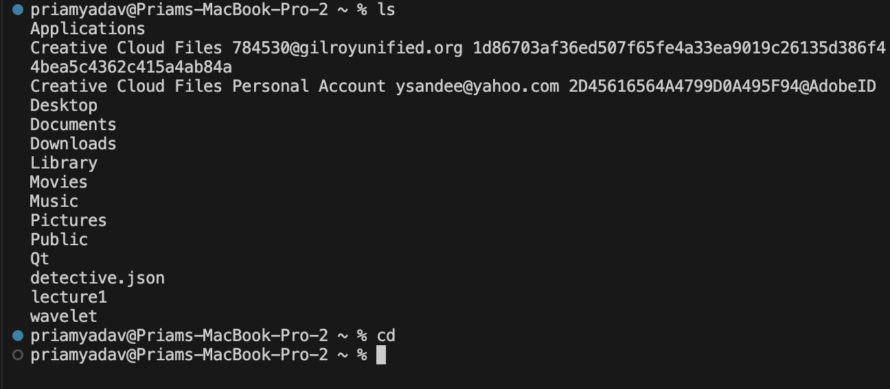
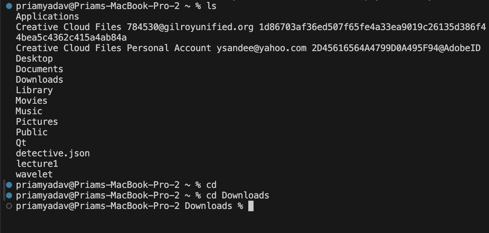

# Lab Report 1 CSE 15l
## *cd Command:*
cd No Arguments:

absolute path: /Users/priamyadav
We got the output of nothing really changing because `cd` without any arguments will bring the parth to the root, which we already started at.

cd Directory:

absolute path: /Users/priamyadav
