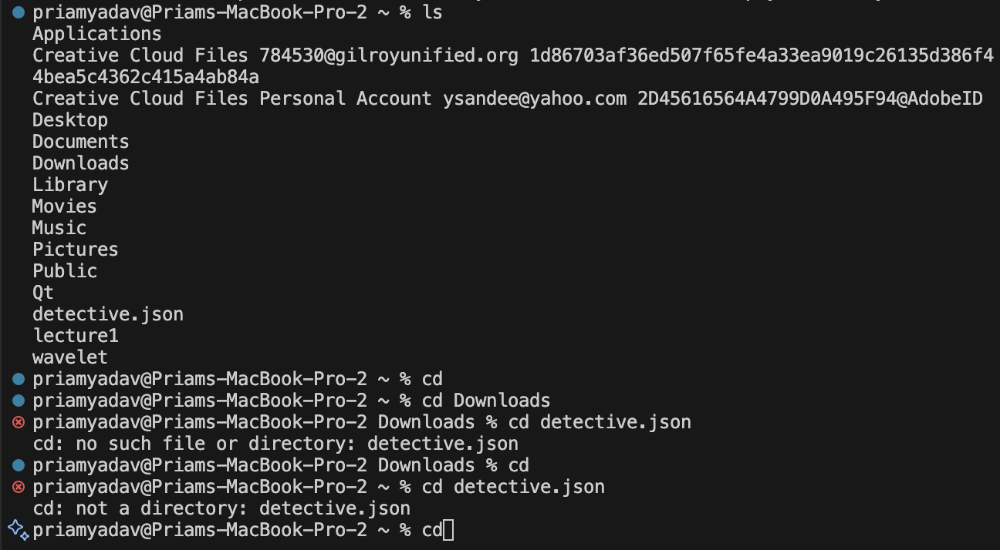
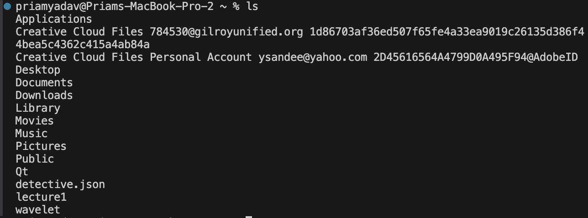
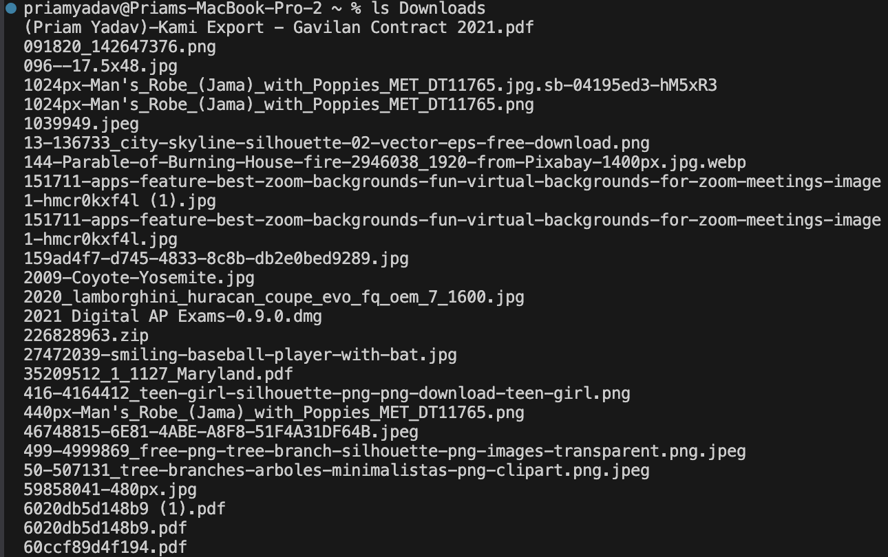
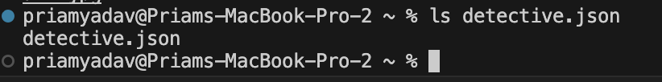
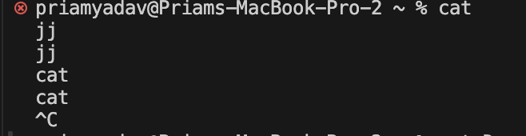
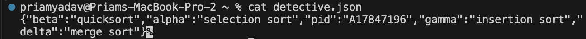

# Lab Report 1 CSE 15l
## *`cd` Command:*
`cd` No Arguments:

absolute path: `/Users/priamyadav`
We got the output of nothing really changing because `cd` without any arguments will bring the parth to the home directory, which we already started at. It is not an error

`cd` Directory:

absolute path: `/Users/priamyadav`
Now we can see that the path has gone to the directory of downloads on my computer because using the command `cd` along with the directory brought us there. It is not an error

`cd` File:

absolute path: `/Users/priamyadav/Downloads`
We can see an error message being brought up because `cd` can only be used with directories, not files.

## *`ls` Command*
`ls` No Arguments:

absolute path: `/Users/priamyadav`
Looks like `ls` command lists the files when we start off at the home directory with no arguments. It is not an error

`ls` Directory:

absolute path: `/Users/priamyadav`
Now using the `ls` command with the argument of the `Downloads` directory, we can see a list of all the files in the directory. It is not an error.

`ls` File:

absolute path: `/Users/priamyadav`
The `ls` command with the argument of the `.json` file just prints out the file name. It is not an error.

## *`cat` Command*
`cat` No Arguments:

absolutepath: `/Users/priamyadav`
It doesn't really give off an input, I have to `control C` my way out of the loop. It is not an error, however it is reading data from it's standard input and writing them to its standard output.

`cat` Directory:

absolutepath: `/Users/priamyadav`
It seems to let us know that `Downloads` is a directory. It is an error because a directory isn't like a file that can display readable content.

`cat` File:

absolutepath: `/Users/priamyadav`
It displays different objects in the `.json` file. It is not an error.
